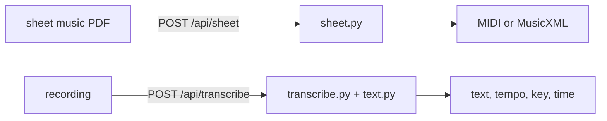
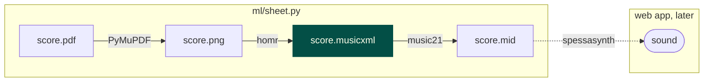
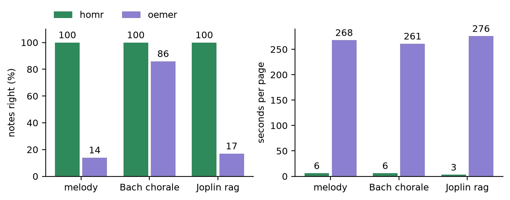

# ml

Two tools, one API. `app.py` is untouched.



```bash
pip install -r ml/requirements.txt    # Python 3.11+
cp ml/.env.example ml/.env            # add your OpenAI key (only /transcribe needs it)
python ml/api.py                      # API on :8002
curl -F file=@score.pdf localhost:8002/api/sheet -o score.mid
curl -F file=@score.pdf "localhost:8002/api/sheet?as=musicxml" -o score.musicxml
curl -F file=@clip.mp3 localhost:8002/api/transcribe
```

To serve it from the main site later, add two lines to `app.py`:

```python
from ml.api import api
app.register_blueprint(api)
```

## Sheet music to sound



```bash
pip install -r ml/requirements.txt    # Python 3.11+
python ml/sheet.py score.pdf       # makes score.png, score.musicxml, score.mid
```

Open `score.musicxml` in [MuseScore](https://musescore.org) to see and hear what was read.

**Why this stack**
- **PyMuPDF**: one line, nothing else to install. pdf2image needs Poppler.
- **homr**: read every test note right, in seconds. oemer, our first pick, missed most notes on two of three pages, took minutes, and needed three fixes to run on a Mac.
- **MusicXML** (green): the file we keep. Holds the notation: bars, key, clefs. MIDI keeps the sound, not the page.
- **music21**: one line. Also knows the bar and beat of every note.
- **spessasynth + MuseScore_General.sf3**: plays MIDI in the browser with real instrument sounds, MIT licence. Tone.js cannot load sound fonts.

[](homr_vs_oemer/)

**Limits**: page 1 only. Tested on clean printed PDFs. `score_teaser.png` shows what homr saw. homr and PyMuPDF are AGPL, fine while this repo is public.

## Recording to text

Turns a recording into text, then pulls tempo / key / time signature out of the text.

### 1. Install
```
pip install -r ml/requirements.txt
```

### 2. Add your OpenAI key
```
cp ml/.env.example ml/.env
```
Open `ml/.env`, replace `sk-your-key-here` with your key from https://platform.openai.com/api-keys.

`.env` is gitignored. Do not commit it.

### 3. Check it works (no key needed)
```
python ml/test_text.py
```
Should print `ok`.

### 4. Run on a recording
```
python ml/run.py clip.mp3
```
Should print:
```
{
  "text": "Minuet in G major at 80 bpm, three four.",
  "segments": [{"start": 0.0, "end": 3.2, "text": "Minuet in G major at 80 bpm, three four."}],
  "music": {"tempo": 80, "key": "G major", "time_signature": "3/4"}
}
```
Any mp3, m4a, wav or webm under 25 MB works.

### What each file does
- `transcribe.py` sends the audio to Whisper, gets text back.
- `text.py` reads the text, finds tempo / key / time signature.
- `run.py` runs both and prints the result.
- `test_text.py` checks `text.py` on three example sentences.

### To extend
- New music info: add one regex line in `text.py`.
- Use from the website: `from ml.transcribe import transcribe` and `from ml.text import process`.
